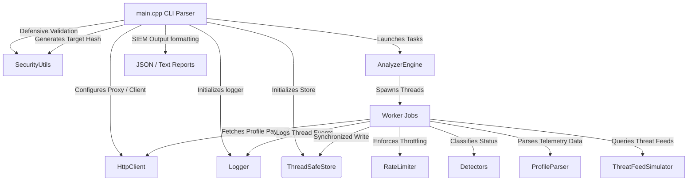

# Multi-Threaded Identity Leak Analyzer (Offline Simulation)

A namespaced, library-grade C++ simulation framework designed to demonstrate production-level multi-threading, thread-safe data synchronization, cryptographic input anonymization, and defensive input sanitization paradigms.

> [!IMPORTANT]
> **Offline Simulation & Local Mock Data**: This repository is a simulated demonstration environment and runs **entirely offline**. It does **not** connect to live external servers, perform active scraping, or query real-world leak databases. Instead, it uses pre-configured mock tables and locally defined mock network routing behaviors (e.g. SOCKS5 proxy logs) to simulate production threat intelligence pipelines. This keeps the environment safe, compliant, and easy to run immediately upon cloning without external API dependencies.

### 📺 Interactive Terminal Demo

[](https://asciinema.org/a/cmsJzxNdcIECRhcK)

This repository includes a recorded terminal session demonstrating target compilation, concurrent proxy routing logs, and input validation engine blocking in real-time.

To play the recording locally in your terminal, run:
```bash
asciinema play demo.cast
```

## 🚀 Key Software Engineering Highlights (Recruiter TL;DR)

This project showcases several production-grade C++ patterns:
1. **Target-Executable Architecture Separation**: Core scanning algorithms are compiled as a separate static library target (`libanalyzer_core.a`) and linked against the main command-line application client.
2. **Namespace Isolation (`leak_analyzer`)**: All components and interfaces are encapsulated within the `leak_analyzer` namespace to prevent global namespace pollution and provide clean SDK packaging.
3. **Library-Style Namespaced Includes**: Headers are organized inside `include/leak_analyzer/` and registered with the include path, allowing imports using namespaced brackets (e.g. `#include <leak_analyzer/analyzer_engine.hpp>`) instead of brittle relative paths.
4. **Thread-Safe Concurrent Storage**: A generic template-based container (`ThreadSafeStore`) utilizing standard `std::mutex` wrappers and RAII-based `std::lock_guard` to enforce race-condition prevention during concurrent updates.
5. **Defensive Input Sanitization**: Implements strict whitelisting character verification (`SecurityUtils::validate_input`) to detect and abort processing of malicious payloads, preventing injection risks before threads are spawned.
6. **Anonymized Query Architecture (SHA-256)**: Features a fully self-contained, header-only SHA-256 implementation to hash sensitive input identifiers (like emails or domain names) before querying simulated database tables. This preserves search privacy in threat intelligence pipelines.
7. **SIEM Integration (JSON Reporting)**: Implements automated JSON report serialization dynamically matching schemas ingestion-ready for Enterprise SIEM platforms (such as Splunk or Elastic Stack).

---

## 📐 System Architecture



---

## 🛠️ Compilation and Setup

This project uses CMake for clean, cross-platform compilation.

### Prerequisites
* A C++ compiler supporting C++17 or higher (GCC, Clang, or MSVC)
* CMake (Version 3.12 or higher)

### Build Instructions

```bash
# Clone the repository and navigate to the project directory
cd identity_leak_analyzer

# Configure the build directory
cmake -B build -S .

# Compile the target binary
# Compile all targets including unit tests
cmake --build build
```

The compiled binaries will be placed inside the `build/` directory.

### Running Unit Tests

To run the automated validation test suite (which verifies SHA-256 generation, input whitelisting, profile parsing, rate-limiting, and concurrent database storage safety):

```bash
./build/leak_analyzer_tests
```

---

## 💻 Usage & CLI Reference

Run the tool using the following options to test its various diagnostic capabilities:

```bash
./build/identity_leak_analyzer --help
```

### CLI Command Options:
* `--credentials <path>`: Specify the credentials JSON configuration path.
* `--tor-proxy <ip:port>`: Configure proxy address telemetry (e.g. `127.0.0.1:9050`).
* `--target <username>`: Run scanning exclusively on a single target username.
* `--output <path>`: Path to write the output report. **Specify a `.json` extension to write structured SIEM reports.**

### Example Usage:

1. **Batch Scan (SIEM JSON Report)**:
   ```bash
   ./build/identity_leak_analyzer --credentials config.json --output report.json
   ```
2. **Single Target Scan (Text Report)**:
   ```bash
   ./build/identity_leak_analyzer --credentials config.json --target test_leak --output report.txt
   ```
3. **Malicious Input Block Demonstration**:
   ```bash
   ./build/identity_leak_analyzer --target "bad_user;rm -rf"
   ```

---

## 📂 Project Directory Structure

```text
identity_leak_analyzer/
├── CMakeLists.txt              # CMake library and binary target configs
├── config.json                 # Sample standalone JSON credentials template
├── include/
│   └── leak_analyzer/           # Namespaced C++ SDK headers
│       ├── analyzer_engine.hpp  # Concurrent engine interface
│       ├── detectors.hpp        # Profile status signature rules
│       ├── http_client.hpp      # Proxy and client session simulator
│       ├── logger.hpp           # Thread-safe ANSI console logger
│       ├── profile_parser.hpp   # Profile parsing declarations
│       ├── rate_limiter.hpp     # Rate limiting logic
│       ├── security_utils.hpp   # Input validation & SHA-256 algorithm
│       ├── thread_safe_store.hpp# RAII concurrent data storage template
│       └── threat_feed.hpp      # Mock database query interfaces
└── src/
    ├── analyzer_engine.cpp     # Parallel query loop logic
    ├── main.cpp                # CLI parser and report formatting
    ├── profile_parser.cpp      # Profile parsing implementation
    └── threat_feed.cpp         # Mock threat lookup logic
```
